# Data Analysis Tool
Purpose of this repository is to create a dynamic tool that is consisting of python and pandas scripts for auto data analysis of structured/semi structured datasets located on AWS,Azure storage, local folder or SQL database.

Initiation of tool could be done by 3 different options
First, for single files on cloud storage by running jupyter notebook located on (https://github.com/Giray18/data_analysis_tool/blob/main/data_analysis_by_loop.ipynb) a xmlx formatted data analysis summary of source dataset being saved into working directory. Example of output file can be found on below folder location.(https://github.com/Giray18/data_analysis_tool/tree/main/sample_analysis_results)
Applied analysis methods are being saved in helper file located on (https://github.com/Giray18/data_analysis_tool/blob/main/dat/analysis_dict.py), by adjusting this helper file applied methods can be adjusted.

Second, for multiple files located on cloud storage or in a local folder by running jupyter notebook located on (https://github.com/Giray18/data_analysis_tool/blob/main/data_analysis_by_loop.ipynb) required data analysis can be applied.

Third, for analysis of data located on sql tables on a spesific database methods on (https://github.com/Giray18/data_analysis_tool/blob/main/dat/multiple_dataset_apply_sql.py) can be used.

Also, python program located on (https://github.com/Giray18/data_analysis_tool/blob/main/auto_run.py) can be run by task manager of operating system. By this way data analysis scripts run and creates daily data analysis result files of tables located in sql database with saving them to working directory as partitioned by date.

## Elements of Repository
### DAT Python Package : 
A created python package holding methods that can make dynamic data analysis based on data types exist on dataset. Mentioned methods are defined below; (Package link : https://github.com/Giray18/data_analysis_tool/tree/main/dat)
  
  **analysis_dict.py** : A customizable dict generator that will put methods into dict. All data analysis activities will be done according to selected methods in dict

  **df_shape.py** : Returns a table that shows row and column count on the dataset 
  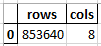  
  
  **df_col_types.py** : Returns a dataframe that defines datatypes of fields on dataset
  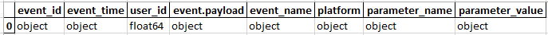
  
  **df_head.py** : Returns a dataframe shows first 5 rows of dataset for quick check of values in table  
  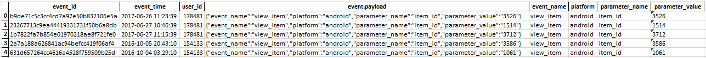

  **df_unique_cols.py** : Returns a dataframe shows field names that holds only unique values / No duplication
  
  **df_date_time.py** : Returns table consisting of date-time values holding fields, min date-time on mentioned column, max date-time on mentioned column, difference between min and max values on mentioned column
  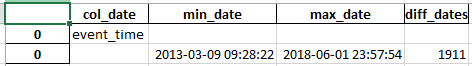
  
  **df_describe_all.py** : Returns table that is holding general stats regarding to all fields of dataset (e.g count, unique values count, top frequency value, (mean, std. min and ntiles for numeric columns))
  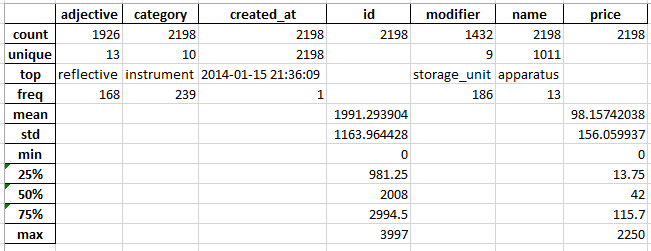
  
  **df_describe_non_numerical.py** : Returns table that is holding general stats regarding to non numeric fields of dataset (e.g count, unique values count, top frequency value)
  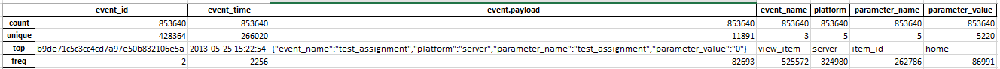

  **df_detect_json.py** : Returns table that holds names of JSON structured value holding fields 
  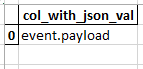

  **df_detect_xml.py** : Returns table that holds names of XML structured value holding fields 
  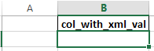

  **df_duplicate_count.py** : Returns table that holds amount of duplicate rows in dataset 
  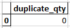

  **df_flatten_json.py** : Returns table that flattens JSON structured value holding fields and merges them into main dataset

  **df_null_counts.py** : Returns table that shows count of null value holding rows per field and their percent to total row count per field.
  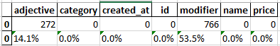

  **df_value_counts.py** : Returns table that shows value counts on a field that is more than %5 of entire field row amount.
  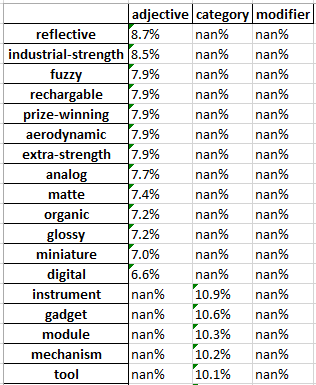

  **df_data_dict.py** : Creates an excel file that holds SQL table names, table field names and data types that column holding. Data types defined based on spesific regex pattern.

  **df_find_value.py** : Finds spesific value on defined SQL database and returns table name, column name that spesific value is located.

  **multiple_dataset_apply_containing_cols.py** : Detects SQL table field names which is equal or in another table's field. This is helpful when detecting potential key columns. That method skips "ID" keyword holding fields to eliminate Primary key/Index columns

## Other files on repo : 

  **multiple_files_analysis (ipynb notebook) :**
  A jupyter notebook holding python and pandas scripts that runs all methods defined above by a loop for all files in a storage cloud/local file host and saves output file in working directory. 
  Currently, multiple file read feature is available for only Azure storage and localfile storage.

  **auto_run.py :**
  A python file that is being used to run daily auto task by task manager of operating system. Based on daily run analysis belongs to current date automatically being saved to working directory

  **automater.bat :**
  Batch file for run analysis automatically by task manager of operating system.

  **Date-Time named folders (2024-03-06) :**
  A partitioned file based on current date-time of system. Holds analysis results belongs to current date. 

  **playground (ipynb notebook) :**
  A jupyter notebook that is being used for dev purposes

  **data_analysis_by_loop (ipynb notebook) :**
  A Jupyter notebook holding python and pandas scripts that runs all methods defined above by a loop and saves output file in working directory.  
  Only "Read dataset from cloud storage" code chunk should be configured according to cloud platform that is being used for dataset source before creating dataframe variable (df).
  
  **old_versions file :** 
  Notebooks created on dev process

  **data_analysis_tool_output_screenshots :**
  Screenshots belongs to output of dat package methods after applied df passed to data_analysis_by_loop (ipynb notebook)

  **sample_analysis_results :**
  Holding excel sheets that are example of data analysis outcomes

  **Chinook.db :** 
  Sample sqlite database used for dev purposes.

  

  

  

